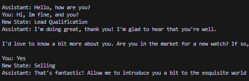
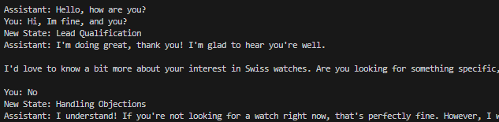
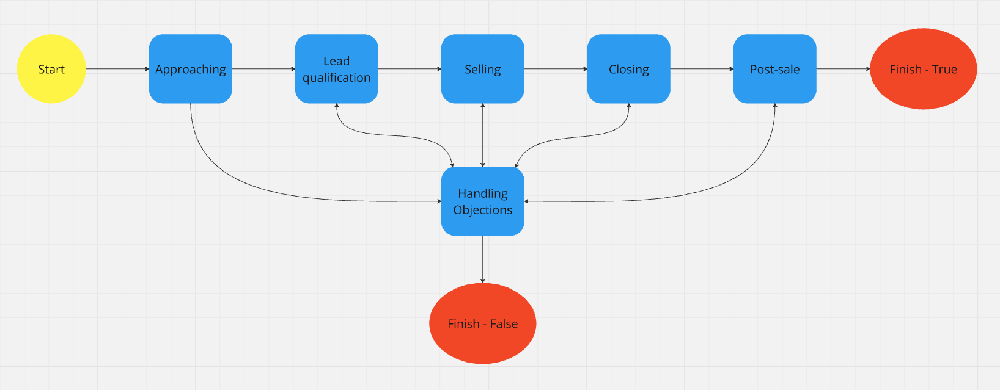

# GPT State Machine 🇧🇷

This project implements a **State Machine** using ChatGPT to manage conversational flows in a structured and dynamic way.

## 🚀 Features

- State management for interactions with ChatGPT.
- Definition of conditions for state transitions.
- Modular structure for easy customization.

## 📦 Installation

1. Clone the repository:

   ```sh
   git clone https://github.com/MarceloAssis123/GPTStateMachine
   cd GPTStateMachine/src
   ```

2. Install dependencies:

   ```sh
   pip install -r requirements.txt
   ```

## ⚙️ How to Use

1. Define your states and transitions in the `utils.py` file.
2. Configure your OpenAI API key in the `.env` file.
3. Run the program:

   ```sh
   python main.py
   ```

## 🛠 Configuration

To use this project, create a `.env` file and add your OpenAI key:

```sh
OPENAI_API_KEY="your-key-here"
```

## 📜 Usage Example




## State Machine Diagram used in the example


## 📄 License

This project is licensed under the [MIT](LICENSE) license.

---

Created by [Marcelo Assis](https://github.com/MarceloAssis123) 🫡
